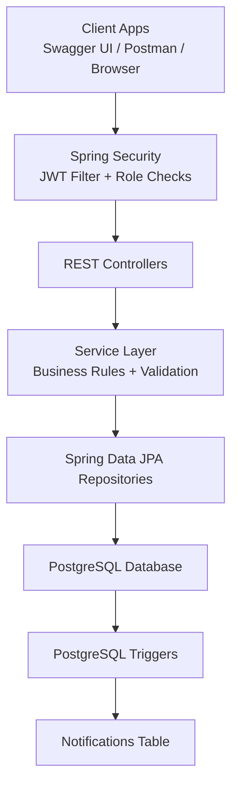
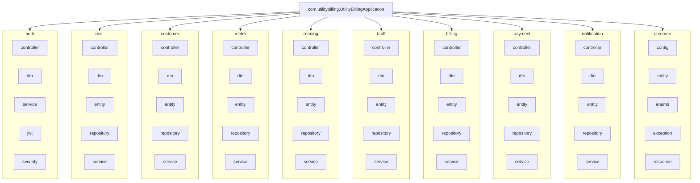
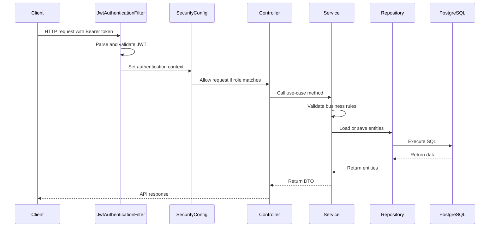
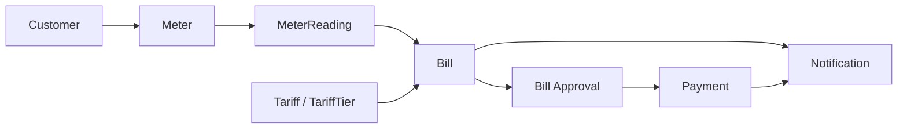
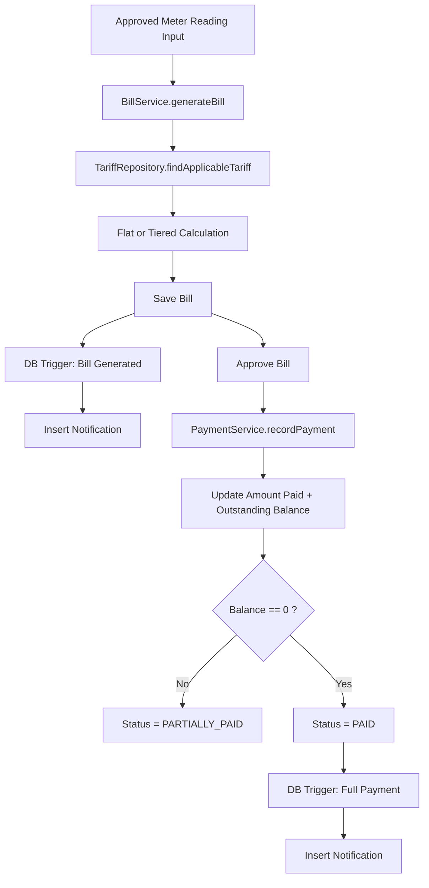
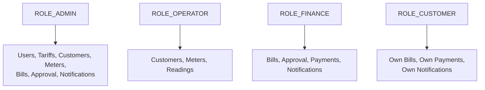

# Application Architecture

This document shows the current implemented architecture of the Utility Billing System.

## High-Level Architecture

## Package Architecture

## Runtime Request Flow

## Domain Workflow Architecture

## Billing and Notification Flow

## Current Role Boundaries

## Notes

- This is a monolithic Spring Boot MVC application.
- Controllers expose DTO-based APIs, not entities directly.
- Business rules are enforced in services and reinforced with PostgreSQL constraints.
- Notification creation for billing events is handled by PostgreSQL triggers.
- Customer self-service access is scoped through the authenticated user account.
